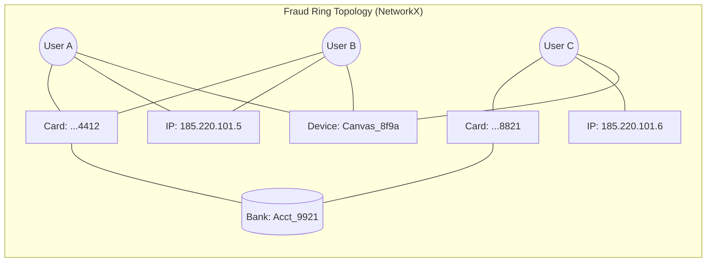
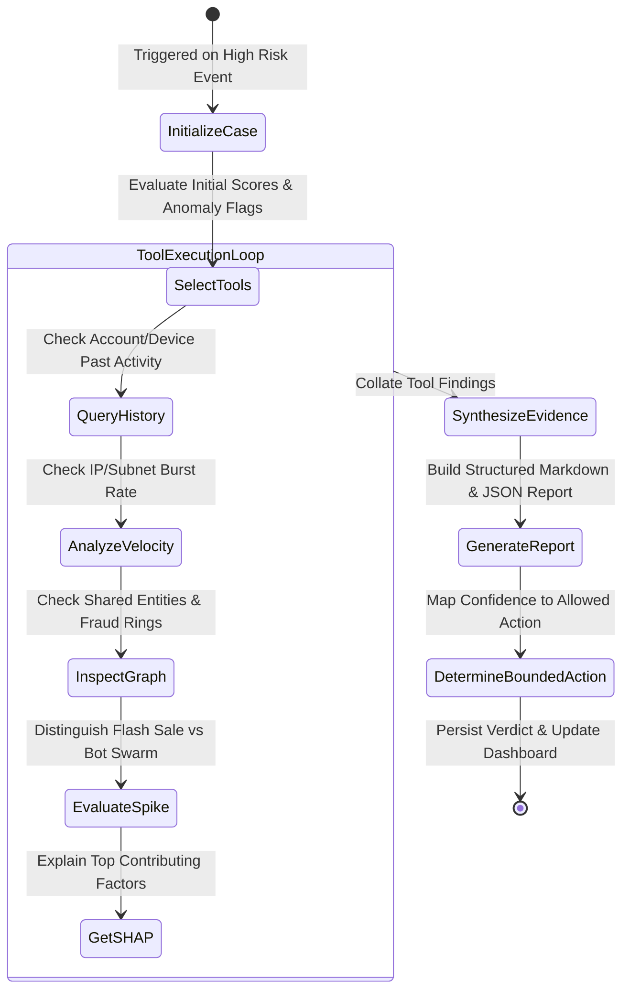
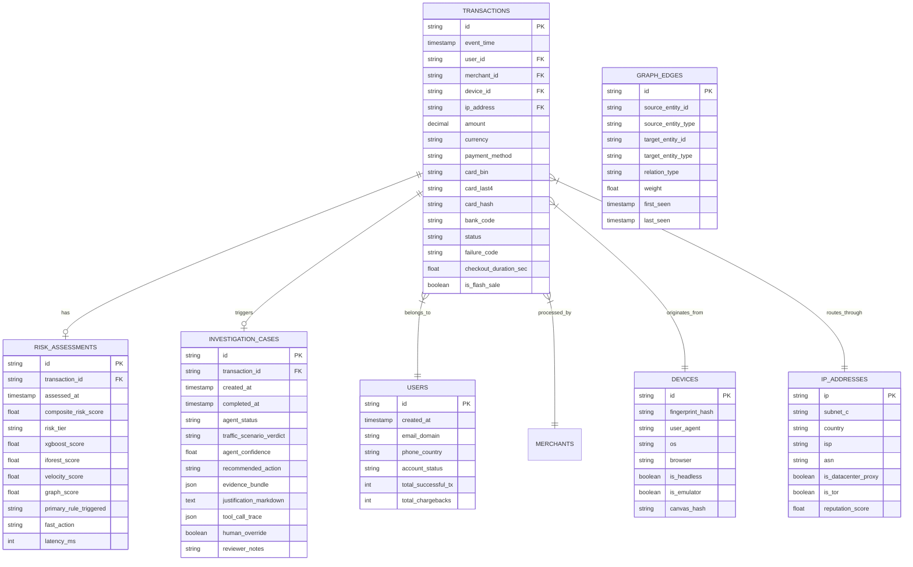

# RazorGuard AI: Architecture & Technical Design Document

**Project:** RazorGuard AI  
**Track:** Razorpay AI Buildathon 2026 — Track 2: AI Risk Manager  
**Core Mission:** An agentic risk detection system that distinguishes legitimate payment traffic spikes from coordinated fraud and automated abuse.

---

## 1. Executive Summary & Problem Analysis

Payment platforms process billions of dollars across fluctuating traffic patterns. During high-velocity events (e.g., Diwali flash sales, festival clearances, viral product drops), payment volume surges by 10x–100x. Simultaneously, malicious actors exploit high-volume windows to launch coordinated attacks, including automated bot credential stuffing, distributed card cracking (carding), promotional voucher abuse, and synthetic identity fraud rings.

### The Critical Industry Dilemma: Spikes vs. Attacks

```
                                  PAYMENT TRAFFIC BURST
                                            │
                    ┌───────────────────────┴───────────────────────┐
                    ▼                                               ▼
         LEGITIMATE FLASH SALE                             COORDINATED FRAUD ATTACK
   ┌──────────────────────────────────┐            ┌──────────────────────────────────┐
   │ • High volume & velocity         │            │ • High volume & velocity         │
   │ • High payment success rate (>85%)│           │ • Low payment success rate (<30%)│
   │ • High user / IP / device entropy│            │ • Low user / IP / device entropy │
   │ • Diverse geo-distribution       │            │ • Concentrated subnets / ASNs    │
   │ • Natural shopping cart amounts  │            │ • Scripted / micro amounts       │
   │ • Established user accounts      │            │ • Fresh accounts / headless bots │
   └──────────────────────────────────┘            └──────────────────────────────────┘
                    │                                               │
                    ▼                                               ▼
             ACTION: ALLOW                                   ACTION: RATE_LIMIT /
            (Zero Friction)                                  STEP_UP_VERIFICATION
```

Traditional rule-based systems fail in two distinct ways:
1. **False Positives (Lost Revenue & Brand Damage):** Aggressive rules block genuine buyers during flash sales because velocity thresholds trigger uniformly.
2. **False Negatives (Chargebacks & Processing Fines):** Permissive rules allow coordinated fraud rings and distributed botnets to slip through undetected under the cover of peak volume.

### The RazorGuard AI Solution
RazorGuard AI introduces a multi-tiered, hybrid detection paradigm:
- **Tier 1 (Sub-25ms Synchronous ML & Rules):** Dual ML models (supervised XGBoost for known attack vectors + unsupervised Isolation Forest for zero-day behavioral anomalies) combined with high-throughput rolling velocity features.
- **Tier 2 (Graph Analytics Engine):** NetworkX-powered relational graph mapping multi-hop links across Accounts, Devices, IP Subnets, Card BINs, and Merchant IDs to detect fraud rings and syndicated abuse.
- **Tier 3 (Agentic AI Investigation):** An asynchronous, tool-calling AI agent (LangGraph) that investigates borderline and anomalous events, extracts SHAP explainability insights, inspects graph neighborhoods, verifies hypotheses, and recommends bounded defensive actions (`ALLOW`, `MONITOR`, `STEP_UP_VERIFICATION`, `RATE_LIMIT`).

> **Fundamental Design Mandate:** The LLM is **never** the primary numeric classifier. Deterministic statistical metrics and ML models calculate empirical risk probabilities (0–100). The AI Agent serves as a senior risk investigator—inspecting evidence via structured tools, contextualizing traffic conditions, generating auditable explanations, and applying safe, bounded policy actions.

---

## 2. Traffic Scenarios & Detection Taxonomy

RazorGuard AI evaluates and classifies payment events into six canonical scenarios:

| # | Scenario | Defining Characteristics | Key Signals & Behavioral Signatures | System Verdict |
|---|---|---|---|---|
| 1 | **Normal Traffic** | Steady baseline transactions across heterogeneous merchants. | Normal velocity, high card diversity, expected success rates (>92%), clean device fingerprints. | `ALLOW` |
| 2 | **Legitimate Traffic Spike** | Flash sales, festival rush, product drops (e.g., iPhone launch). | High volume, high success rate (>80%), high entropy across IP subnets/devices, natural cart distributions, organic checkout latencies (>8s). | `ALLOW` |
| 3 | **Automated Bot Abuse** | Scripted credential stuffing, rapid automated checkouts, brute force attacks. | Millisecond submission velocity (<1.5s checkout), headless browser headers, zero mouse/keyboard entropy, fixed request cadence, uniform user-agents. | `RATE_LIMIT` / `STEP_UP_VERIFICATION` |
| 4 | **Payment Abuse** | Card cracking/testing, promo code farming, rapid refund cycling. | Micro-amount transactions ($0.50–$2.00), sequential CVV/expiry attempts, high card decline velocity, multiple cards tried on single account. | `STEP_UP_VERIFICATION` / `RATE_LIMIT` |
| 5 | **Coordinated Multi-Entity Abuse** | Distributed attack using distinct accounts sharing underlying infrastructure. | New accounts created within minutes, sharing identical hardware fingerprints (Canvas/WebGL hash) or rotating through adjacent `/24` proxy subnets. | `STEP_UP_VERIFICATION` / `RATE_LIMIT` |
| 6 | **Fraud Rings** | Syndicated criminal rings laundering funds or exploiting merchant vulnerabilities. | High graph density, cyclic money flow, shared withdrawal bank accounts or virtual credit cards across ostensibly unrelated accounts and merchants. | `RATE_LIMIT` / Deep Investigation Case |

---

## 3. End-to-End System Architecture

```mermaid
flowchart TB
    subgraph INGESTION["1. Ingestion Layer"]
        A[Synthetic Payment Stream] -->|HTTP POST| B[FastAPI Gateway /ingest]
        B --> C[Pydantic v2 Event Validator]
    end

    subgraph STREAM_ENG["2. Real-Time Feature Store & Velocity Engine"]
        C --> D[Windowed Velocity Aggregator]
        D -->|5m / 1h / 24h Windows| E[Feature Vector Builder]
        E --> F[(PostgreSQL / SQLite Event Store)]
    end

    subgraph DETECTION["3. Dual-Layer ML & Heuristic Scoring (<25ms)"]
        E --> G1[Supervised XGBoost Classifier]
        E --> G2[Unsupervised Isolation Forest]
        E --> G3[Deterministic Rule Engine]
        G1 --> H[Composite Risk Scorer]
        G2 --> H
        G3 --> H
    end

    subgraph GRAPH_ENGINE["4. Graph Analytics Engine (NetworkX)"]
        C -.->|Async Update| I[Relational Graph Builder]
        I --> J[Community Detection & Centrality]
        J --> K[Fraud Ring / Clique Detector]
        K -->|Graph Risk Penalty| H
    end

    subgraph DECISION_GATE["5. Fast-Path Decision Gate"]
        H --> L{Risk Score Tier}
        L -->|< 30 (Low Risk)| M1[Action: ALLOW]
        L -->|30 - 65 (Medium Risk)| M2[Action: MONITOR]
        L -->|> 65 (Suspicious / High)| N[Trigger Async Agent Investigation]
    end

    subgraph AGENT_LAYER["6. LangGraph AI Investigation Agent"]
        N --> O[Investigation State Orchestrator]
        O --> P[Tool Calling Suite]
        
        subgraph AGENT_TOOLS["Investigation Tools"]
            P1[query_user_history]
            P2[analyze_velocity_bursts]
            P3[inspect_graph_neighborhood]
            P4[get_shap_feature_importance]
            P5[distinguish_spike_pattern]
        end
        P --> P1 & P2 & P3 & P4 & P5
        P1 & P2 & P3 & P4 & P5 --> Q[Evidence Synthesis & Hypothesis Evaluation]
        Q --> R[Explainable Risk Report Generator]
        Q --> S[Bounded Action Decision Engine]
    end

    subgraph BOUNDED_ACTIONS["7. Defensive Actions"]
        S --> T1[ALLOW]
        S --> T2[MONITOR]
        S --> T3[STEP_UP_VERIFICATION]
        S --> T4[RATE_LIMIT]
    end

    subgraph PRESENTATION["8. Operations & Analytics Dashboard (Streamlit)"]
        F --> U[Streamlit Real-Time Console]
        R --> U
        T1 & T2 & T3 & T4 --> U
        I --> U
    end
```

---

## 4. Component Deep Dive

### 4.1. Fast-Path Ingestion & Feature Engineering Layer
- **Input:** Raw payment event payloads (`POST /api/v1/events/ingest`).
- **Validation:** Pydantic v2 schema validation enforcing strict typing, timestamp validation, card BIN masks, and device fingerprint standards.
- **Sliding Window Aggregators:**
  - `user_velocity_5m`, `user_velocity_1h`, `user_velocity_24h`
  - `ip_velocity_5m`, `ip_failed_tx_ratio_5m`, `ip_distinct_cards_1h`
  - `device_velocity_5m`, `device_distinct_users_24h`
  - `card_velocity_5m`, `card_declines_1h`
  - `merchant_volume_5m`, `merchant_success_ratio_5m`
  - **Spike Context Features:** `entropy_of_ips_5m`, `entropy_of_devices_5m`, `mean_checkout_duration_sec`.

### 4.2. Dual Machine Learning Layer
1. **Supervised XGBoost Classifier:**
   - Trained on multi-scenario synthetic data with balanced representation of normal, spike, and attack patterns.
   - Outputs: $P(\text{Fraud})$, $P(\text{Bot})$, $P(\text{Abuse})$.
   - TreeExplainer calculates exact SHAP values in $<5\text{ms}$ for real-time feature attribution.
2. **Unsupervised Isolation Forest:**
   - Detects zero-day anomalies, anomalous volume combinations, and novel attack distributions without relying on labels.
   - Outputs normalized Anomaly Score $S_{\text{iso}} \in [0, 1]$.
3. **Composite Scoring Function:**
   $$\text{RiskScore} = \min\left(100, \, \left(w_{\text{xgb}} \cdot P_{\text{xgb}} + w_{\text{iso}} \cdot S_{\text{iso}} + w_{\text{vel}} \cdot S_{\text{velocity}} + w_{\text{graph}} \cdot S_{\text{graph}}\right) \times 100 + \text{RulePenalties}\right)$$
   - Weights configured by default: $w_{\text{xgb}} = 0.40$, $w_{\text{iso}} = 0.20$, $w_{\text{vel}} = 0.20$, $w_{\text{graph}} = 0.20$.

### 4.3. Graph Analytics Engine (NetworkX)
- **Node Types:** `Account`, `Device`, `IPAddress`, `CardHash`, `BankAccount`, `Merchant`.
- **Edge Types:** `USED_DEVICE`, `ORIGINATED_FROM_IP`, `PAID_WITH_CARD`, `TRANSFERRED_TO_BANK`, `PAID_TO_MERCHANT`.
- **Algorithms:**
  - **Connected Components:** Subgraph extraction around any entity within 2 hops.
  - **Shared Infrastructure Ratio:** Degree centrality of devices and IPs (e.g., 1 Device connected to $>10$ Accounts in $<1\text{h}$).
  - **Clique & Cycle Detection:** Identifying closed rings of money flow or circular charge transfers.



### 4.4. AI Risk Investigation Agent (LangGraph)
The AI Agent is triggered when an event is classified as borderline or high risk ($\text{RiskScore} \ge 65$), or during unexpected anomaly spikes.

#### Agent State Machine


#### Tool Calling Suite
1. `query_user_history(user_id: str, days: int = 30)`: Returns user tenure, total successful payments, chargeback count, known devices.
2. `analyze_velocity_and_bursts(entity_type: str, entity_value: str, window_minutes: int = 15)`: Queries sliding window transaction rate, failure ratio, and velocity spikes.
3. `inspect_graph_neighborhood(entity_id: str, hops: int = 2)`: Returns connected subgraphs, shared accounts per device, and community cluster ID.
4. `get_shap_feature_importance(transaction_id: str)`: Returns top 5 positive and negative contributing features for the XGBoost score.
5. `distinguish_spike_pattern(merchant_id: str, window_minutes: int = 10)`: Calculates merchant-wide entropy of IPs/devices, overall success rate, and shopping cart variance to confirm legitimate flash sale status.

#### Bounded Action Guardrails

```
┌─────────────────────────┬───────────────────────────────────┬──────────────────────────────────────┐
│ ACTION                  │ ELIGIBILITY CRITERIA              │ ENFORCEMENT MECHANISM                │
├─────────────────────────┼───────────────────────────────────┼──────────────────────────────────────┤
│ ALLOW                   │ Risk < 30 OR Legitimate Flash     │ Immediate payment processing with    │
│                         │ Sale confirmed with high entropy  │ zero friction.                       │
├─────────────────────────┼───────────────────────────────────┼──────────────────────────────────────┤
│ MONITOR                 │ Risk 30–65, minor anomaly,        │ Process payment, tag transaction for │
│                         │ trusted user history              │ post-auth settlement review.         │
├─────────────────────────┼───────────────────────────────────┼──────────────────────────────────────┤
│ STEP_UP_VERIFICATION    │ Risk 65–85, new device/IP,        │ Trigger mandatory 3D-Secure / OTP    │
│                         │ medium bot probability            │ challenge before authorization.      │
├─────────────────────────┼───────────────────────────────────┼──────────────────────────────────────┤
│ RATE_LIMIT              │ Risk > 85, automated bot bursts,  │ Temporarily throttle IP/Device token │
│                         │ carding attack, high failure rate │ for 15 minutes; reject burst.        │
└─────────────────────────┴───────────────────────────────────┴──────────────────────────────────────┘
```

---

## 5. Database Schema (PostgreSQL + SQLAlchemy)



---

## 6. REST API Design & Contracts

### 6.1. Event Ingestion (`POST /api/v1/events/ingest`)
- **Request Payload:**
```json
{
  "event_id": "evt_98f41a02-b1c4-42f0-bc32-11a243e8910a",
  "timestamp": "2026-09-01T18:15:30.120Z",
  "user_id": "usr_78341",
  "merchant_id": "mer_electronics_india",
  "amount": 49999.00,
  "currency": "INR",
  "payment_method": "credit_card",
  "card": {
    "bin": "411111",
    "last4": "1111",
    "network": "VISA",
    "issuer_bank": "HDFC"
  },
  "device": {
    "device_id": "dev_f41a998c21",
    "fingerprint_hash": "canvas_e891729ab",
    "user_agent": "Mozilla/5.0 (Windows NT 10.0; Win64; x64) Chrome/128.0.0.0",
    "is_headless": false,
    "is_emulator": false
  },
  "network": {
    "ip_address": "49.37.142.89",
    "vpn_detected": false,
    "tor_detected": false
  },
  "context": {
    "checkout_duration_sec": 14.2,
    "cart_items_count": 2,
    "is_flash_sale_active": true
  }
}
```
- **Synchronous Response (< 25ms):**
```json
{
  "event_id": "evt_98f41a02-b1c4-42f0-bc32-11a243e8910a",
  "transaction_id": "tx_448109",
  "status": "PROCESSED",
  "risk_assessment": {
    "composite_risk_score": 18.5,
    "risk_tier": "LOW",
    "action": "ALLOW",
    "model_scores": {
      "xgboost_fraud_prob": 0.08,
      "isolation_forest_anomaly": 0.12,
      "velocity_anomaly": 0.10,
      "graph_risk_penalty": 0.00
    },
    "traffic_spike_context": {
      "is_legitimate_spike": true,
      "spike_confidence": 0.94,
      "entropy_score": 0.88
    },
    "latency_ms": 14
  },
  "investigation_triggered": false
}
```

### 6.2. Trigger Case Investigation (`POST /api/v1/investigations/trigger/{tx_id}`)
- Triggers asynchronous LangGraph agent investigation for borderline or audited transactions.

### 6.3. Retrieve Case Investigation (`GET /api/v1/investigations/{case_id}`)
- Returns the complete explainable case file including agent reasoning, tool call trace, SHAP feature attributions, graph evidence, and bounded action recommendation.

### 6.4. Spike vs. Attack Analytics (`GET /api/v1/analytics/spike-vs-attack`)
- Returns rolling 5-minute window metrics comparing transaction velocity vs. IP entropy, device entropy, and success rate curves.

### 6.5. Graph Cluster Inspection (`GET /api/v1/graph/cluster/{entity_id}`)
- Returns 2-hop relational subgraph in node-link JSON format ready for interactive Streamlit / Plotly network rendering.

---

## 7. Streamlit Dashboard Architecture

The frontend is structured into four primary operational modules:

```
┌────────────────────────────────────────────────────────────────────────────┐
│                    RAZORGUARD AI - RISK OPS COMMAND                        │
├─────────────────┬─────────────────┬───────────────────┬────────────────────┤
│ 1. Live Stream  │ 2. Spike vs     │ 3. Investigation  │ 4. Graph Explorer  │
│    Operations   │    Attack Studio│    Case Review    │    & Rings         │
├─────────────────┴─────────────────┴───────────────────┴────────────────────┤
│ • Real-time TPS & Approval Rate KPI Metrics                                │
│ • Dual-stream Live Feed (Normal / Legitimate Spike / Coordinated Attack)   │
│ • Interactive Scenario Injector (Flash Sale, Carding Botnet, Fraud Ring)   │
│ • LangGraph Step-by-Step Agent Reasoning Inspector & Evidence Tree         │
│ • Plotly Interactive Network Graph with Entity Clique Highlighting         │
│ • SHAP Waterfall Feature Contribution Chart for Risk Explanations          │
│ • Bounded Action Control Room & Human Analyst Override Panel               │
└────────────────────────────────────────────────────────────────────────────┘
```

---

## 8. Directory & Project Structure

```
RazorGuard-AI/
├── .github/
│   └── workflows/
│       └── ci.yml                 # Automated testing & linting pipeline
├── configs/
│   ├── app_config.yaml            # Thresholds, weights, API timeouts
│   └── logging_config.yaml        # Structured logging formatters
├── data/
│   ├── synthetic/                 # Seed datasets & generated scenarios
│   └── models/                    # Serialized XGBoost & Isolation Forest artifacts
├── docs/
│   ├── ARCHITECTURE.md            # Complete architectural design (this file)
│   ├── IMPLEMENTATION_PLAN.md     # Phase-by-phase implementation roadmap
│   └── API_REFERENCE.md           # Full OpenAPI specifications
├── src/
│   ├── __init__.py
│   ├── api/                       # FastAPI application & routers
│   │   ├── __init__.py
│   │   ├── main.py                # App entrypoint & middleware
│   │   ├── routes/
│   │   │   ├── events.py          # Ingestion & evaluation endpoints
│   │   │   ├── investigations.py  # AI agent case review endpoints
│   │   │   ├── analytics.py       # Spike vs Attack & KPI metrics
│   │   │   └── graph.py           # Network subgraph query endpoints
│   │   └── schemas/               # Pydantic v2 request/response schemas
│   │       ├── events.py
│   │       ├── risk.py
│   │       └── investigations.py
│   ├── core/                      # Engine foundations & configuration
│   │   ├── config.py              # Pydantic Settings & environment vars
│   │   ├── database.py            # SQLAlchemy engine, session maker
│   │   └── logging.py             # Structured logger
│   ├── database/                  # ORM models & repository layer
│   │   ├── __init__.py
│   │   ├── models.py              # Transactions, Users, Devices, Cases
│   │   └── repository.py          # CRUD & optimized sliding window queries
│   ├── features/                  # Real-time feature engineering
│   │   ├── __init__.py
│   │   ├── velocity.py            # Sliding window rolling velocity metrics
│   │   ├── entropy.py             # IP & device entropy / spike detectors
│   │   └── pipeline.py            # Feature vector assembly pipeline
│   ├── ml/                        # Machine learning engines
│   │   ├── __init__.py
│   │   ├── xgboost_model.py       # Supervised classifier wrapper & SHAP
│   │   ├── isolation_forest.py    # Unsupervised anomaly detector
│   │   ├── rules.py               # Deterministic rule engine & penalties
│   │   ├── composite_scorer.py    # Multi-signal risk fusion formula
│   │   └── trainer.py             # Model training & serialization script
│   ├── graph/                     # Graph analytics engine
│   │   ├── __init__.py
│   │   ├── graph_builder.py       # NetworkX dynamic graph manager
│   │   ├── ring_detector.py       # Clique & connected component analyzer
│   │   └── metrics.py             # Node degree & centrality calculations
│   ├── agent/                     # LangGraph AI Investigation Agent
│   │   ├── __init__.py
│   │   ├── state.py               # LangGraph state definition
│   │   ├── graph.py               # Agent state machine workflow
│   │   ├── tools.py               # Investigation tool implementations
│   │   ├── prompts.py             # System prompts & reasoning templates
│   │   └── actions.py             # Bounded defensive action decision logic
│   ├── generator/                 # Synthetic data & scenario generator
│   │   ├── __init__.py
│   │   ├── profiles.py            # User, device, card, merchant profiles
│   │   ├── scenarios.py           # 6 scenario stream generators
│   │   └── stream_simulator.py    # Real-time event emitter / stress tester
│   └── dashboard/                 # Streamlit operational UI
│       ├── app.py                 # Main Streamlit dashboard entrypoint
│       ├── components/
│       │   ├── metrics_banner.py  # Live KPI cards
│       │   ├── live_feed.py       # Real-time transaction stream
│       │   ├── spike_analyzer.py  # Spike vs Attack visualization
│       │   ├── case_inspector.py  # Agent reasoning & SHAP view
│       │   └── graph_visualizer.py# Plotly interactive 2D graph
│       └── utils.py               # API client & plotting helpers
├── tests/                         # Comprehensive pytest test suite
│   ├── conftest.py                # Test fixtures & synthetic db
│   ├── unit/                      # Unit tests for ML, features, graph
│   │   ├── test_features.py
│   │   ├── test_ml_models.py
│   │   ├── test_graph_engine.py
│   │   └── test_rules.py
│   ├── integration/               # API & agent integration tests
│   │   ├── test_api_routes.py
│   │   └── test_agent_workflow.py
│   └── e2e/                       # End-to-end scenario validation
│       └── test_scenarios.py      # Verifies 6 traffic scenarios
├── Dockerfile.api                 # Container definition for FastAPI
├── Dockerfile.dashboard           # Container definition for Streamlit
├── docker-compose.yml             # Full-stack composition (API, DB, UI)
├── requirements.txt               # Pinned Python dependencies
└── README.md                      # Project documentation & runbook
```

---

## 9. Security, Privacy & Compliance Safeguards

1. **Synthetic Data Sandbox:** No connection to real banking rails, live card numbers, or production Razorpay APIs. All card numbers use standardized test BINs (`411111`, `510510`) with cryptographically anonymized hashes.
2. **Deterministic Guardrails:** The LLM agent cannot issue arbitrary API commands or execute unbounded blockades; actions are restricted to the strict enum: `[ALLOW, MONITOR, STEP_UP_VERIFICATION, RATE_LIMIT]`.
3. **Auditability & Explainability:** Every agent investigation produces an immutable audit record containing the exact prompt, tool call outputs, SHAP explanations, and human-readable Markdown justifications.
