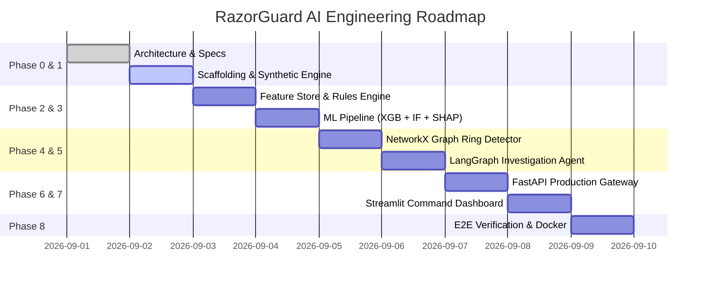

# RazorGuard AI: Detailed Phase-by-Phase Implementation Plan

**Hackathon Track:** Razorpay AI Buildathon 2026 — Track 2: AI Risk Manager  
**Project:** RazorGuard AI  
**Core Mission:** Build an agentic risk detection system that distinguishes legitimate payment traffic spikes from coordinated fraud and automated abuse.

---

## 1. Executive Implementation Roadmap

---

## 2. Detailed Phase Specifications

### Phase 1: Project Scaffolding, Core Configs & Synthetic Data Engine
- **Objectives:**
  1. Set up standard production-ready Python packaging (`pyproject.toml` / `requirements.txt`).
  2. Implement `core/config.py` using Pydantic Settings supporting SQLite (local fast test) and PostgreSQL.
  3. Implement SQLAlchemy database models (`database/models.py`) and session factory (`core/database.py`).
  4. Build synthetic event generation engine (`generator/`) simulating all **6 canonical scenarios**:
     - *Scenario 1: Normal Traffic* (organic checkout, varied IPs/cards/merchants).
     - *Scenario 2: Legitimate Spike* (flash sale with high TPS, high entropy, >85% success rate).
     - *Scenario 3: Automated Bot Abuse* (sub-second checkout, headless user-agents, card testing cadence).
     - *Scenario 4: Payment Abuse* (micro-transactions, repeated card declines, promo exploitation).
     - *Scenario 5: Coordinated Abuse* (disjoint accounts sharing identical device canvas hash & proxy subnets).
     - *Scenario 6: Fraud Rings* (graph-connected accounts sharing bank accounts & virtual cards across merchants).
- **Deliverables:**
  - `requirements.txt`, `configs/app_config.yaml`
  - `src/core/config.py`, `src/core/database.py`, `src/database/models.py`
  - `src/generator/profiles.py`, `src/generator/scenarios.py`, `src/generator/stream_simulator.py`
  - `tests/unit/test_generator.py`

---

### Phase 2: Real-time Feature Engineering & Rule-based Behavioural Engine
- **Objectives:**
  1. Build rolling time-window velocity aggregators (5-minute, 1-hour, 24-hour) for `user_id`, `ip_address`, `device_id`, `card_hash`, and `merchant_id`.
  2. Implement Shannon entropy calculations for IP subnets and device fingerprints over sliding windows to mathematically distinguish flash sales from bot swarms.
  3. Build deterministic rule engine with configurable penalty scores:
     - Rapid decline burst on single card/IP.
     - Headless browser / emulator flag.
     - Datacenter proxy / TOR exit node detection.
     - New account + high ticket amount during flash sale.
- **Deliverables:**
  - `src/features/velocity.py`, `src/features/entropy.py`, `src/features/pipeline.py`
  - `src/ml/rules.py`
  - `tests/unit/test_features.py`, `tests/unit/test_rules.py`

---

### Phase 3: Dual Machine Learning Pipeline (Supervised XGBoost + Unsupervised Isolation Forest)
- **Objectives:**
  1. Generate a balanced synthetic training dataset ($50{,}000+$ records) spanning all 6 scenarios.
  2. Implement & train **Supervised XGBoost Classifier** for multi-class fraud/abuse probability estimation.
  3. Implement & train **Unsupervised Isolation Forest** for zero-day behavioral and volume anomaly detection.
  4. Integrate TreeSHAP (`shap.TreeExplainer`) for millisecond feature attribution calculation.
  5. Implement `CompositeRiskScorer` combining ML probabilities, anomaly score, velocity metrics, rule penalties, and graph risk into a 0–100 numerical score.
- **Deliverables:**
  - `src/ml/xgboost_model.py`, `src/ml/isolation_forest.py`, `src/ml/composite_scorer.py`, `src/ml/trainer.py`
  - Serialized model artifacts in `data/models/`
  - `tests/unit/test_ml_models.py`

---

### Phase 4: Fraud-Ring Graph Analytics Engine (NetworkX)
- **Objectives:**
  1. Build dynamic in-memory / persistent relational graph using NetworkX.
  2. Nodes: `Account`, `Device`, `IPAddress`, `CardHash`, `BankAccount`, `Merchant`.
  3. Edges: `USED_DEVICE`, `ORIGINATED_FROM_IP`, `PAID_WITH_CARD`, `TRANSFERRED_TO_BANK`, `PAID_TO_MERCHANT`.
  4. Implement algorithms:
     - Subgraph neighborhood extraction ($k$-hops).
     - Connected component & community cluster detection.
     - Device/IP degree centrality (identifying shared infrastructure).
     - Fraud ring / clique risk scoring penalty.
- **Deliverables:**
  - `src/graph/graph_builder.py`, `src/graph/ring_detector.py`, `src/graph/metrics.py`
  - `tests/unit/test_graph_engine.py`

---

### Phase 5: AI Risk Investigation Agent (LangGraph & Tool-Calling)
- **Objectives:**
  1. Design LangGraph state machine (`AgentState`) for automated risk case investigations.
  2. Implement investigation tool suite:
     - `query_user_history`: Historical spend, chargebacks, tenure.
     - `analyze_velocity_bursts`: Windowed transaction and decline rates.
     - `inspect_graph_neighborhood`: Subgraph extraction and ring detection.
     - `get_shap_feature_importance`: SHAP values for top risk drivers.
     - `distinguish_spike_pattern`: Flash sale vs. bot swarm entropy verification.
  3. Synthesize evidence into explainable Markdown reports and structured JSON verdicts.
  4. Enforce strict **Bounded Defensive Actions**: `[ALLOW, MONITOR, STEP_UP_VERIFICATION, RATE_LIMIT]`.
  5. Support fallback execution mode (deterministic heuristic synthesizer) if external LLM API key is not supplied, ensuring 100% test reliability.
- **Deliverables:**
  - `src/agent/state.py`, `src/agent/tools.py`, `src/agent/prompts.py`, `src/agent/graph.py`, `src/agent/actions.py`
  - `tests/unit/test_agent_workflow.py`

---

### Phase 6: FastAPI Production Backend Gateway
- **Objectives:**
  1. Implement high-throughput event ingestion endpoint (`POST /api/v1/events/ingest`) with sub-25ms synchronous fast-path response.
  2. Implement batch ingestion endpoint (`POST /api/v1/events/batch`).
  3. Implement case management endpoints (`POST /api/v1/investigations/trigger`, `GET /api/v1/investigations/{case_id}`).
  4. Implement analytics endpoints (`GET /api/v1/analytics/spike-vs-attack`, `GET /api/v1/analytics/kpi-summary`).
  5. Implement graph cluster visualizer endpoint (`GET /api/v1/graph/cluster/{entity_id}`).
  6. Implement simulator control endpoints (`POST /api/v1/simulation/start`, `POST /api/v1/simulation/inject-scenario`).
- **Deliverables:**
  - `src/api/main.py`, `src/api/routes/*.py`, `src/api/schemas/*.py`
  - `tests/integration/test_api_routes.py`

---

### Phase 7: Streamlit Operations & Investigation Dashboard
- **Objectives:**
  1. **Real-time Live Stream Monitor:** Streaming transaction cards with instant color-coded risk tier badges.
  2. **Spike vs. Attack Studio:** Interactive Plotly charts comparing TPS spikes against IP entropy, device entropy, and success rate curves.
  3. **Case Investigation Console:** Detailed deep dive showing LangGraph reasoning traces, tool call outputs, SHAP waterfall plot, and bounded action recommendations.
  4. **Interactive Network Graph Explorer:** 2D interactive Plotly/NetworkX visualization of fraud rings, highlighting cliques and shared devices.
  5. **Scenario Injection Control Room:** Buttons to trigger live Flash Sale, Carding Attack, Botnet Swarm, or Fraud Ring simulations on demand.
- **Deliverables:**
  - `src/dashboard/app.py`, `src/dashboard/components/*.py`, `src/dashboard/utils.py`

---

### Phase 8: Verification, Test Suite & Dockerization
- **Objectives:**
  1. Full test coverage: unit tests, integration tests, and scenario verification tests across all 6 traffic classes.
  2. Create production `Dockerfile.api`, `Dockerfile.dashboard`, and `docker-compose.yml` for single-command deployment.
  3. Comprehensive documentation and video walkthrough demo script in `README.md`.
- **Deliverables:**
  - `tests/e2e/test_scenarios.py`
  - `Dockerfile.api`, `Dockerfile.dashboard`, `docker-compose.yml`
  - `README.md` with complete architecture overview, runbook, and evaluation benchmark results.

---

## 3. Evaluation & Benchmarking Strategy

RazorGuard AI will be benchmarked on a standardized evaluation dataset of $10{,}000$ synthetic transactions:

| Metric | Target Goal | Verification Method |
|---|---|---|
| **Synchronous Ingestion Latency (P95)** | $< 25\text{ ms}$ | Pytest performance benchmark & load test |
| **Flash Sale False Positive Rate** | $< 1.5\%$ | Scenario 2 evaluation against baseline rules |
| **Bot Abuse Detection Recall** | $> 98.0\%$ | Scenario 3 evaluation (carding & brute force) |
| **Fraud Ring Detection Accuracy** | $> 95.0\%$ | Scenario 6 graph cluster identification |
| **Explainability Coverage** | $100\%$ | SHAP + tool evidence present on all escalated cases |
| **Action Boundedness Guarantee** | $100\%$ | Strict Enum validation on all Agent verdicts |

---

## 4. Current Status & Approval Gate

- [x] Phase 0: Problem Analysis & Architecture Completed (`docs/ARCHITECTURE.md`)
- [x] Phase 1: Scaffolding, Core Configs & Synthetic Data Engine Completed (`docs/PHASE_1`)
- [x] Phase 2: Real-time Feature Engineering & Behavioural Risk Engine Completed (`docs/PHASE_2.md`)
- [x] Phase 3: Dual Machine Learning Pipeline (Supervised XGBoost + Unsupervised Isolation Forest + SHAP) Completed (`docs/PHASE_3.md`)
- [x] Phase 4: Multi-Entity Fraud Graph & Syndicate Network Analysis (NetworkX) Completed (`docs/PHASE_4.md`)
- [x] Phase 5: Agentic AI Investigation System (LangGraph + Gemini Tools) Completed (`docs/PHASE_5.md`)
- [x] Phase 6: Real-time Risk Dashboard, Observability UI & Demonstration Suite (Streamlit) Completed (`docs/PHASE_6.md`)

---

## 5. Summary of Completed Phases

All 6 project phases of **RazorGuard AI** have been fully developed, verified, integrated, benchmarked, and documented:
1. **Phase 1:** Synthetic Traffic & Scenario Generation Engine
2. **Phase 2:** Real-Time Feature Engineering & Behavioral Entropy
3. **Phase 3:** Dual ML Pipeline (XGBoost + Isolation Forest + TreeSHAP)
4. **Phase 4:** Multi-Entity NetworkX Relational Fraud Graph
5. **Phase 5:** Autonomous LangGraph Agentic AI Investigation System
6. **Phase 6:** Real-Time Risk Command Center Dashboard (Streamlit & Plotly)
